# Property Management System - Component Architecture

## Frontend Component Hierarchy

```mermaid
graph TD
    %% Main application structure
    App[App]
    Layout[Layout Component]
    AuthProvider[Auth Provider]
    Router[Router]
    
    %% Core Layout Components
    Sidebar[Sidebar]
    Header[Header]
    Toast[Toast System]
    
    %% Feature Modules
    Dashboard[Dashboard]
    Rooms[Room Management]
    Renters[Renter Management]
    Contracts[Contract Management]
    Services[Service Management]
    Payments[Payment Management]
    Settings[Settings]
    
    %% Dashboard Components
    DashStats[Stats Cards]
    DashCharts[Charts]
    DashNotifications[Notifications]
    DashTasks[Upcoming Tasks]
    
    %% Room Components
    RoomList[Room List/Grid]
    RoomCard[Room Card]
    RoomDetail[Room Detail]
    RoomForm[Room Form]
    
    %% Renter Components
    RenterList[Renter List/Grid]
    RenterCard[Renter Card]
    RenterDetail[Renter Detail]
    RenterForm[Renter Form]
    RenterDocs[Renter Documents]
    
    %% Contract Components
    ContractList[Contract List/Grid]
    ContractDetail[Contract Detail]
    ContractForm[Contract Form]
    
    %% Service Components
    ServiceList[Service List/Grid]
    ServiceDetail[Service Detail]
    ServiceForm[Service Form]
    
    %% Shared Components
    Modal[Modal]
    StatusBadge[Status Badge]
    ViewModeSwitcher[View Mode Switcher]
    DataTable[Data Table]
    PaginationControls[Pagination Controls]
    Filters[Filter Controls]
    
    %% UI Components
    Button[Button]
    Card[Card]
    Input[Input]
    Select[Select]
    Checkbox[Checkbox]
    DatePicker[Date Picker]
    
    %% Core App Structure
    App --> AuthProvider
    App --> Router
    Router --> Layout
    
    %% Layout Structure
    Layout --> Sidebar
    Layout --> Header
    Layout --> Toast
    
    %% Feature Routing
    Layout --> Dashboard
    Layout --> Rooms
    Layout --> Renters
    Layout --> Contracts
    Layout --> Services
    Layout --> Payments
    Layout --> Settings
    
    %% Dashboard Components
    Dashboard --> DashStats
    Dashboard --> DashCharts
    Dashboard --> DashNotifications
    Dashboard --> DashTasks
    
    %% Room Components
    Rooms --> RoomList
    RoomList --> RoomCard
    Rooms --> RoomDetail
    Rooms --> RoomForm
    
    %% Renter Components
    Renters --> RenterList
    RenterList --> RenterCard
    Renters --> RenterDetail
    Renters --> RenterForm
    RenterDetail --> RenterDocs
    
    %% Contract Components
    Contracts --> ContractList
    Contracts --> ContractDetail
    Contracts --> ContractForm
    
    %% Service Components
    Services --> ServiceList
    Services --> ServiceDetail
    Services --> ServiceForm
    
    %% Shared Component Usage
    RoomList --> ViewModeSwitcher
    RoomList --> Filters
    RoomList --> PaginationControls
    RoomCard --> StatusBadge
    RoomDetail --> StatusBadge
    
    RenterList --> ViewModeSwitcher
    RenterList --> Filters
    RenterList --> PaginationControls
    RenterCard --> StatusBadge
    
    ContractList --> ViewModeSwitcher
    ContractList --> Filters
    ContractList --> PaginationControls
    ContractDetail --> StatusBadge
    
    ServiceList --> ViewModeSwitcher
    ServiceList --> Filters
    ServiceList --> PaginationControls
    
    %% Modal Usage
    RoomDetail --> Modal
    RoomForm --> Modal
    RenterDetail --> Modal
    RenterForm --> Modal
    ContractForm --> Modal
    ServiceForm --> Modal
    
    %% UI Component Usage
    RoomForm --> Input
    RoomForm --> Select
    RoomForm --> Button
    RoomForm --> DatePicker
    
    RenterForm --> Input
    RenterForm --> Select
    RenterForm --> Button
    RenterForm --> DatePicker
    
    ContractForm --> Input
    ContractForm --> Select
    ContractForm --> Checkbox
    ContractForm --> Button
    ContractForm --> DatePicker
    
    ServiceForm --> Input
    ServiceForm --> Select
    ServiceForm --> Button
    
    RoomCard --> Card
    RenterCard --> Card
```

## Component Organization Pattern

### Core Structure
- **App**: Root component providing global context and routing
- **Layout**: Main layout wrapper including navigation and persistent UI elements
- **AuthProvider**: Authentication and authorization context provider
- **Router**: Manages application routing with React Router

### Feature Modules
Each feature module follows a similar pattern:
1. **List/Grid View**: Displays collection of entities with filtering and sorting
2. **Detail View**: Shows comprehensive information about a single entity
3. **Form**: Handles create/edit operations for the entity
4. **Card**: Compact representation used in lists/grids

### Shared Components
- **StatusBadge**: Consistent status visualization across all features
- **ViewModeSwitcher**: Toggles between list and grid views
- **DataTable**: Reusable table with sorting and selection
- **Modal**: Standardized modal dialog system
- **Toast**: Notification system for user feedback
- **Filters**: Consistent filtering interface for all list views

### UI Component Library
Core UI primitives built with Radix UI and styled with Tailwind:
- Buttons, Cards, Inputs, Selects, Checkboxes, DatePickers, etc.

## State Management
- Component-level state with React hooks
- Context API for feature-specific state (e.g., Toast notifications)
- Zustand for global application state

## Data Flow Pattern
1. User interactions trigger component-level handlers
2. Handlers update local state or dispatch actions to global state
3. API calls are made through service functions
4. UI updates reflect state changes with appropriate loading/error states
5. Toast notifications provide feedback on action success/failure

## Responsive Design
All components adapt to different viewport sizes using Tailwind's responsive utilities:
- Mobile-first approach
- Breakpoint-specific layouts
- Conditional rendering of UI elements
- Grid/list view adapts to available space 